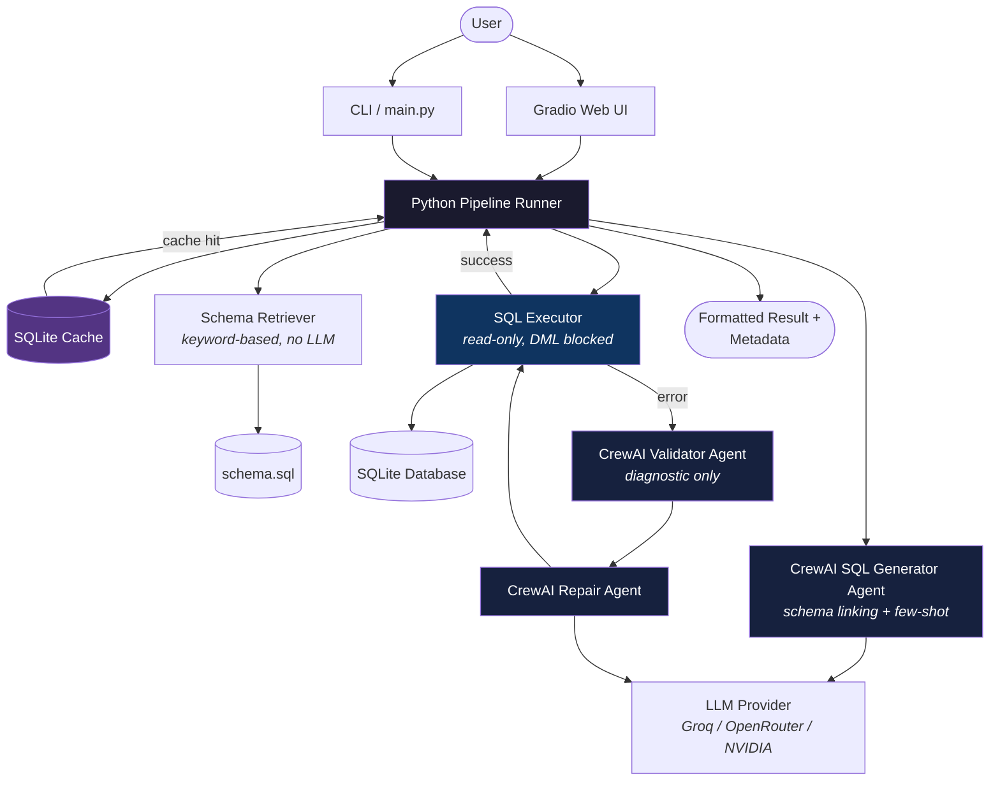

# QueryPilot — Multi-Agent Text-to-SQL System

Ask questions about a relational database in natural language and receive executable SQL and results.

---

## Overview

SQL is the standard language for querying relational databases, but writing correct SQL requires knowing the schema, join relationships, aggregation syntax, and dialect-specific quirks. For non-technical users — and even experienced engineers working with unfamiliar schemas — this creates a barrier between a question and the data that answers it.

**QueryPilot** bridges that gap. It takes a natural-language question (e.g., *"Which customer has placed the most orders?"*), translates it into executable SQL, runs it against a real database, and returns the results — all through a web interface or command line.

Under the hood, the system uses [CrewAI](https://www.crewai.com/) to orchestrate specialized LLM agents for SQL generation, validation, and repair, while Python controls the execution pipeline, enforces safety constraints, and manages a bounded self-repair loop when queries fail.

### Who is this for?

- Software and AI engineers exploring agent-based architectures for data access
- Teams prototyping natural-language interfaces to internal databases
- Anyone interested in a working Text-to-SQL system with separation of concerns between LLM reasoning and deterministic execution

---

## Real-World / Business Use Cases

A system like QueryPilot is useful anywhere non-technical users need to extract answers from a relational database without writing SQL:

| Scenario | Example Question |
|---|---|
| **Sales teams** reviewing revenue | *"What is the total revenue from delivered orders?"* |
| **Operations** checking inventory | *"Which products have fewer than 30 units in stock?"* |
| **Customer support** looking up orders | *"Show me all pending orders with customer names"* |
| **Business analysts** exploring data | *"What is the average rating for electronics products?"* |
| **Data teams** building internal tools | Embedding a natural-language query layer in dashboards or Slack bots |

> **Note on production readiness:** This project demonstrates the core Text-to-SQL pipeline. A real production deployment would additionally require authentication, authorization, database-level permissions, query auditing, rate limiting, and input sanitization beyond the read-only guardrails implemented here.

---

## How It Works

The pipeline follows a clear sequence where **Python is the source of truth** for SQL execution, and LLM agents handle the reasoning-heavy tasks:

```
User question
  → Schema retrieval         (Python — keyword matching, no LLM call)
  → Schema linking + few-shot prompting
  → CrewAI SQL Generator     (LLM agent generates SQL)
  → Python SQL execution     (SQLite, read-only, blocked DML)
  → If execution fails:
      → CrewAI Validator     (LLM agent diagnoses the error)
      → CrewAI Repair Agent  (LLM agent produces corrected SQL)
      → Python re-executes   (up to 3 attempts, then stops)
  → Final result
  → Gradio UI / CLI output
```

### Why Python controls execution

The LLM agents never execute SQL themselves. Python runs every query through a `SQLExecutor` with read-only enforcement and DML blocking (`DROP`, `DELETE`, `INSERT`, etc. are rejected). This means the agents can only *suggest* SQL — the system decides whether to run it.

### Why the repair loop is bounded

The repair loop runs a maximum of `MAX_REPAIR_ATTEMPTS` iterations (default: 3). If the repaired SQL still fails after 3 attempts, the pipeline returns the error rather than looping indefinitely. This prevents runaway LLM calls and keeps latency predictable.

---

## Architecture



---

## Why CrewAI?

CrewAI provides the multi-agent framework that orchestrates the LLM-powered parts of the pipeline. Here is what it contributes:

- **Separation of responsibilities.** SQL generation, validation/analysis, and repair are handled by three distinct agents (`sql_generator`, `sql_validator`, `sql_repair`), each with its own role, goal, and backstory defined in YAML. This makes each agent's prompt focused and its behavior easier to debug or tune independently.

- **Agent/task orchestration.** CrewAI manages the `Agent → Task → Crew` lifecycle, including passing context between agents and invoking the LLM through a provider-agnostic `LLM` object.

- **Tool integration.** The SQL Generator agent has access to a `retrieve_schema` tool — a CrewAI `@tool` wrapper around the deterministic schema retriever — so it can look up table definitions during reasoning.

- **Extensibility.** Adding a new agent (e.g., a query optimizer or an explanation agent) requires adding a YAML config block and a few lines of Python, without restructuring the pipeline.

CrewAI handles *reasoning orchestration*. Python handles *execution, safety, caching, and control flow*. This separation keeps the system predictable while leveraging LLM capabilities where they add value.

---

## Key Features

Every feature listed below is implemented in the current codebase:

| Feature | Description |
|---|---|
| **Natural-language-to-SQL** | Accepts plain English questions and generates executable SQL |
| **Multi-table relational database** | Ships with a 5-table e-commerce schema (customers, products, orders, order_items, reviews) with foreign key relationships |
| **Schema retrieval** | Keyword-based retriever ranks tables by relevance to the question — no LLM call required |
| **Schema linking** | The SQL Generator agent maps question concepts to specific tables and columns before writing SQL |
| **Few-shot prompting** | The generation prompt includes worked examples (COUNT, JOIN, GROUP BY, etc.) to guide the LLM |
| **CrewAI agents** | Three specialized agents — Generator, Validator, Repair — each with YAML-defined roles and goals |
| **Execution-based error detection** | Python executes the generated SQL and catches real database errors, not just LLM self-assessment |
| **Bounded self-repair** | Failed queries are sent to the Repair Agent; the loop is capped at 3 attempts to prevent runaway calls |
| **Read-only SQL execution** | The executor enforces `SELECT`-only queries and blocks `DROP`, `DELETE`, `INSERT`, `UPDATE`, `ALTER`, `TRUNCATE`, and `CREATE` |
| **Provider switching** | Swap between Groq, OpenRouter, and NVIDIA NIM by changing one environment variable (`LLM_PROVIDER`) |
| **Persistent caching** | Successful results are cached in a SQLite database with TTL-based expiration (default: 24 hours) |
| **Gradio web interface** | Two-tab UI with a query interface and a benchmark results viewer |
| **Query execution metadata** | Every response includes latency, repair count, cache hit status, model name, and a step-by-step pipeline trace |
| **Evaluation framework** | Execution-accuracy evaluation with per-difficulty breakdowns, an ablation study comparing prompt strategies, and benchmark scripts |

---

## Technology Stack

| Technology | Purpose |
|---|---|
| **Python 3.10+** | Core language; controls the pipeline, execution, and safety |
| **CrewAI** | Multi-agent orchestration (Agent, Task, Crew abstractions) |
| **LiteLLM** | Underlying LLM routing used by CrewAI's `LLM` class |
| **SQLite** | Application database and cache store |
| **Gradio** | Web UI for querying and viewing benchmark results |
| **Groq SDK** | LLM provider — fast inference via Groq API |
| **OpenAI SDK** | Used for OpenRouter and NVIDIA NIM (OpenAI-compatible endpoints) |
| **python-dotenv** | Environment variable management from `.env` files |
| **YAML** | Agent and task configuration (`agents.yaml`, `tasks.yaml`) |

---

## Project Structure

```
text-to-sql-agent/
├── app.py                      # Gradio web UI entry point
├── main.py                     # CLI entry point (interactive + single-query modes)
├── requirements.txt            # Python dependencies
├── pyproject.toml              # Project metadata and dependencies
├── .env.example                # Environment variable template
│
├── src/
│   ├── config.py               # Central settings (LLM, database, pipeline)
│   ├── crewai_runner.py        # CrewAI agent orchestration (generate, validate, repair)
│   ├── crewai_factory.py       # Provider-agnostic CrewAI LLM factory
│   ├── crewai_tools.py         # @tool wrappers for schema retrieval
│   │
│   ├── config/
│   │   ├── agents.yaml         # Agent definitions (role, goal, backstory)
│   │   └── tasks.yaml          # Task templates with prompt structure
│   │
│   ├── agents/                 # Standalone agent classes (non-CrewAI, used by manual runner)
│   │   ├── sql_agent.py
│   │   ├── validator_agent.py
│   │   ├── repair_agent.py
│   │   └── schema_agent.py
│   │
│   ├── pipeline/
│   │   ├── runner.py           # Main pipeline — CrewAI-powered with Python-controlled execution
│   │   └── runner_manual.py    # Alternative pipeline using direct provider calls
│   │
│   ├── execution/
│   │   ├── executor.py         # SQL execution with read-only enforcement and DML blocking
│   │   └── connection.py       # SQLite connection management
│   │
│   ├── schema/
│   │   ├── loader.py           # Parse CREATE TABLE statements into structured objects
│   │   ├── retriever.py        # Keyword-based table relevance ranking
│   │   └── formatter.py        # Format schema objects into LLM-friendly text
│   │
│   ├── cache/
│   │   └── store.py            # SQLite-backed key-value cache with TTL
│   │
│   └── providers/
│       ├── base.py             # Abstract LLMProvider interface + ChatResponse
│       ├── factory.py          # Provider factory (groq / openrouter / nvidia)
│       ├── groq.py             # Groq provider implementation
│       ├── openrouter.py       # OpenRouter provider implementation
│       └── openai_compat.py    # Generic OpenAI-compatible provider (used by NVIDIA)
│
├── data/
│   ├── schema.sql              # E-commerce database schema (5 tables)
│   ├── sample_data.sql         # Seed data (customers, products, orders, reviews)
│   └── app.db                  # SQLite database file
│
├── evaluation/
│   ├── evaluate.py             # Evaluation runner (baseline vs. full pipeline)
│   ├── metrics.py              # Execution-match accuracy and aggregate metrics
│   ├── datasets/               # Test datasets (easy/medium/hard questions with gold SQL)
│   └── results/                # Saved evaluation outputs
│
├── run_eval.py                 # Convenience wrapper for evaluation
├── run_benchmark.py            # 8-question benchmark with incremental saves
├── ablation_study.py           # Compare 4 prompt strategies (baseline, few-shot, schema-linking, combined)
│
├── cache/
│   └── cache.db                # Persistent query cache
└── results/                    # Pipeline run audit logs
```

---

## Example

**User:**

> *"Which customer has placed the most orders?"*

**Generated SQL:**

```sql
SELECT c.name, COUNT(o.order_id) AS order_count
FROM customers c
JOIN orders o ON c.customer_id = o.customer_id
GROUP BY c.name
ORDER BY order_count DESC
LIMIT 1
```

**Result:**

| name | order_count |
|---|---|
| Alice Johnson | 2 |

**Pipeline metadata:**

```
Latency: 1.84s  ·  Repairs: 0  ·  Cache hit: No  ·  Model: openai/llama-3.3-70b
```

**Pipeline steps:**

```
Schema retrieval (2ms) → SQL generation (1832ms) → Execution OK (4ms)
```

---

## Getting Started

### 1. Clone and install

```bash
git clone https://github.com/your-username/text-to-sql-agent.git
cd text-to-sql-agent
pip install -r requirements.txt
```

Or with [uv](https://docs.astral.sh/uv/):

```bash
uv sync
```

### 2. Configure environment

```bash
cp .env.example .env
```

Edit `.env` and add your API key for at least one provider:

| Provider | Variable | Notes |
|---|---|---|
| Groq | `GROQ_API_KEY` | Free tier, fast inference |
| OpenRouter | `OPENROUTER_API_KEY` | Multi-model access |
| NVIDIA NIM | `NVIDIA_API_KEY` | Free tier (1,000 requests/day) |

Set `LLM_PROVIDER` to `groq`, `openrouter`, or `nvidia`.

### 3. Run the web UI

```bash
python app.py
```

Opens a Gradio interface at `http://127.0.0.1:7860` with a **Query** tab and a **Benchmark** tab.

### 4. Run from the command line

```bash
# Interactive mode
python main.py

# Single question
python main.py "How many customers are there?"
```

### 5. Run the evaluation

```bash
# Full pipeline evaluation
python run_eval.py --system full

# Ablation study (compares 4 prompt strategies)
python ablation_study.py

# 8-question benchmark
python run_benchmark.py
```

---

## Configuration

All configuration is managed through environment variables (`.env` file):

| Variable | Default | Description |
|---|---|---|
| `LLM_PROVIDER` | `groq` | Active LLM provider (`groq`, `openrouter`, `nvidia`) |
| `GROQ_API_KEY` | — | API key for Groq |
| `OPENROUTER_API_KEY` | — | API key for OpenRouter |
| `NVIDIA_API_KEY` | — | API key for NVIDIA NIM |
| `DATABASE_URL` | `sqlite:///data/app.db` | Database connection string |
| `MAX_REPAIR_ATTEMPTS` | `3` | Maximum repair loop iterations |
| `CACHE_ENABLED` | `true` | Enable/disable query result caching |

---

## License

This project is provided as-is for educational and portfolio purposes.
